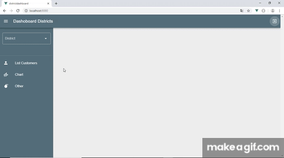

# districtdashboard

Districtdashboard is a dashboard designed to allow the user to verify their customer portfolio.
From the navigation bar it is possible to verify the goals reached by the user clicking on the "Chart tab".
The charts can be dragged and dropped according to the user needs

## Demo


## Project setup
```
npm install
```

### Compiles and hot-reloads for development
```
npm run serve
```

### Run on browser
```
localhost:8080
```

### Compiles and minifies for production
```
npm run build
```

## Usage:

### main.js
```js
import Vue from 'vue'
import App from './App.vue'
import router from './router'
import store from './store'
import vuetify from '@/plugins/vuetify'

Vue.config.productionTip = false

new Vue({
  vuetify,
  router,
  store,
  render: h => h(App)
}).$mount('#app')
```

### router.js
```js
import Vue from 'vue'
import Router from 'vue-router'
import Customers from './views/Customers.vue'
import Targets from './views/Targets.vue'
import Other from './views/Other.vue'

Vue.use(Router)

export default new Router({
  mode: 'history',
  base: process.env.BASE_URL,
  routes: [
    {
      path: '/customers',
      name: 'customers',
      component: Customers
    },
    {
      path: '/targets',
      name: 'targets',
      component: Targets
    },
    {
      path: '/other',
      name: 'other',
      component: Other
    }
  ]
})
```

### App.vue
```js
<template>
  <v-app id="dashboard">
  
    <!-- App bar on top -->
    <v-app-bar app clipped-left color="blue-grey darken-1" dark>
      <!-- 3lines icon on top-left which hides the navigation-drawer -->
      <v-app-bar-nav-icon @click="hide = !hide"></v-app-bar-nav-icon>
      <span class="title ml-3 mr-5">Dashoboard Districts</span>
      <div class="flex-grow-1"></div>

      <!-- tooltip for the icon button -->
      <v-tooltip bottom>
        <template v-slot:activator="{ on }">
          <!-- reset data -->
          <v-btn icon to="/" @click="clear" v-on="on">
            <v-icon>{{resetDataIcon}}</v-icon>
          </v-btn>
        </template>
        <span>Reset Data</span>
      </v-tooltip>
    </v-app-bar>

    <!-- navigation-drawer on left side composed by an title and a text body -->
    <v-navigation-drawer v-model="hide" app clipped color="blue-grey darken-1" dark>
      <!-- header of the navigation-drawer -->
      <v-list-item-title class="title">
      
        <!-- dropdown of the districts list -->
        <v-container>
          <v-row>
            <v-col justify="center">
              <v-select
                :items="listDistricts"
                label="District"
                outlined
                v-model="districtSelected"
                item-text="name"
                item-value="id"
                @change="getCustomersByDistrict"
              ></v-select>
            </v-col>
          </v-row>
        </v-container>
      </v-list-item-title>
      <v-divider></v-divider>

      <!-- body of the navigation-drawer -->
      <v-list app shaped class="blue-grey darken-1" dark>
        <v-list-item
          v-for="item in items"
          :key="item.title"
          :value="item.id"
          link
          router
          :to="item.route"
          color="blue-grey lighten-5"
        >
          <v-list-item-icon>
            <v-icon>{{ item.icon }}</v-icon>
          </v-list-item-icon>

          <v-list-item-content>
            <v-list-item-title>{{ item.title }}</v-list-item-title>
          </v-list-item-content>
        </v-list-item>
      </v-list>
    </v-navigation-drawer>

    <!-- content where I am going to call the router -->
    <v-content class="grey lighten-3 fill-height">
      <router-view
        :list-customers="datacollection.labels"
        :data-collection="datacollection"
        :options-chart="options"
        :show-chart="showChart"
        :add-slots="slots.numAvailable"
      ></router-view>
    </v-content>
  </v-app>
</template>
<script>
import { findDistrictByID, getArrayOfElements } from "./utils/lodash";
import { mdiAccount, mdiFinance, mdiBomb, mdiLoginVariant } from "@mdi/js";
export default {
  name: "dashboard",
  data() {
    return {
      //List districts
      listDistricts: [
        { id: 1, name: "All Districts" },
        { id: 2, name: "Northern" },
        { id: 3, name: "Northern Harbour" },
        { id: 4, name: "Southern Harbour" },
        { id: 5, name: "South Eastern" },
        { id: 6, name: "Western" },
        { id: 7, name: "Gozo and Comino" }
      ],
      districtSelected: undefined,
      listcustomersfiltered: [],
      
      //Data collection for the chart
      datacollection: {
        labels: [],
        datasets: [
          {
            label: "",
            backgroundColor: [""],
            borderColor: [""],
            data: [0]
          }
        ]
      },
      
      //chart options
      options: {
        responsive: true,
        maintainAspectRatio: false
      },
      listCustomers: {
        list: []
      },

      //list of icons and path
      items: [
        {
          id: 1,
          title: "List Customers",
          icon: mdiAccount,
          route: "/customers"
        },
        { id: 2, title: "Chart", icon: mdiFinance, route: "/targets" },
        {
          id: 3,
          title: "Other",
          icon: mdiBomb,
          route: "/other"
        }
      ],
      resetDataIcon: mdiLoginVariant,
      hide: true,
      showChart: {
        show: false
      },
      //Slots as default = 5
      slots: {
        numAvailable: 5
      }
    };
  },
  methods: {
    //load the list of all customers
    getCustomers() {
      var arrayTemp = require("./api/listCustomers.json");
      this.$set(this.listCustomers, "list", arrayTemp);
    },
    clear() {
      this.districtSelected = undefined;
    },
    reset() {
      var resetLabels = undefined;
      var resetOptions = {
        label: undefined,
        backgroundColor: undefined,
        borderColor: undefined,
        data: undefined
      };
      this.$set(this.datacollection, "labels", resetLabels);
      this.$set(this.datacollection, "datasets", resetOptions);
    },
    //Random values for the data collection
    randomColorCustomers() {
      var colorArray = [];
      var rgba = "";
      var rgb = {red: "", green: "", blue: ""};
      for (let cust in this.datacollection.labels) {
        rgb.red = Math.floor(Math.random() * 255);
        rgb.green = Math.floor(Math.random() * 255);
        rgb.blue = Math.floor(Math.random() * 255);
        rgba =
          "rgba(" + rgb.red + ", " + rgb.green + ", " + rgb.blue + ", 0.4)";
        colorArray.push(rgba);
      }
      return colorArray;
    },
    getCustomersByDistrict() {
      this.reset();
      var listCustomersFiltered = [];
      if (this.districtSelected > 1) {
        listCustomersFiltered = findDistrictByID(
          this.listCustomers.list,
          this.districtSelected
        );
      } else {
        listCustomersFiltered = this.listCustomers.list;
      }
      var listNameCustomers = getArrayOfElements(
        listCustomersFiltered,
        "customername"
      );
      if (listNameCustomers.length > 0) {
        this.showChart.show = true;
        this.showChart.text = "Data OK";
      } else {
        this.showChart.show = false;
        this.showChart.text = "no chart data";
      }
      this.$set(this.datacollection, "labels", listNameCustomers);
      var datarray = getArrayOfElements(listCustomersFiltered, "totamount");
      var colors = this.randomColorCustomers();
      var valueProp = [
        {
          label: "Targets",
          backgroundColor: colors,
          borderColor: colors,
          data: datarray
        }
      ];
      this.$set(this.datacollection, "datasets", valueProp);
    }
  },
  mounted() {
    this.getCustomers();
  }
};
</script>
<style lang="scss" scoped>
</style>
```

## Targets.vue:
```js
<template>
  <v-container id="targets" v-if="showChart.show" class="grey lighten-4 my-4" fluid>
    <v-row >
      <draggable class="row wrap">
        <v-col>
          <v-card width="400" height="450">
            <v-card-title>
              <span>Chart</span>
              <div class="flex-grow-1"></div>
              <span>
                <v-icon>{{iconDraggable}}</v-icon>
              </span>
            </v-card-title>
            <v-divider></v-divider>
            <chart :width="400" :height="400" :chart-data="dataCollection" :options="optionsChart" />
          </v-card>
        </v-col>

        <!-- add availables slots -->
        <v-col v-for="i in addSlots" :key="i">
          <v-row style="height:450px;">
            <v-col>
              
              <!-- ADD HERE OTHER CHARTS -->
              <v-card width="400" height="450">
                <v-card-title>
                  <span>Slot id: {{i}}</span>
                  <div class="flex-grow-1"></div>
                  <span>
                    <v-icon>{{iconDraggable}}</v-icon>
                  </span>
                </v-card-title>
                <v-divider></v-divider>
                <v-card-text>
                    available slot for chart
                </v-card-text>
              </v-card>
            </v-col>
          </v-row>
        </v-col>
      </draggable>
    </v-row>
  </v-container>
</template>
<script>
import Chart from "../components/Chart";
import Draggable from "vuedraggable";
import { mdiDragVariant } from "@mdi/js";
export default {
  name: "targets",
  props: ["dataCollection", "optionsChart", "showChart", "addSlots"],
  data() {
    return {
      iconDraggable: mdiDragVariant
    };
  },
  components: {
    Chart,
    Draggable
  }
};
</script>
<style lang="scss">
</style>
```

## Sub-components:
```js
import Chart from "../components/Chart";
import Draggable from "vuedraggable";
```

### Reference:
  - https://vue-chartjs.org/guide/
  - https://github.com/SortableJS/Vue.Draggable
  - https://sortablejs.github.io/Vue.Draggable/#/simple


